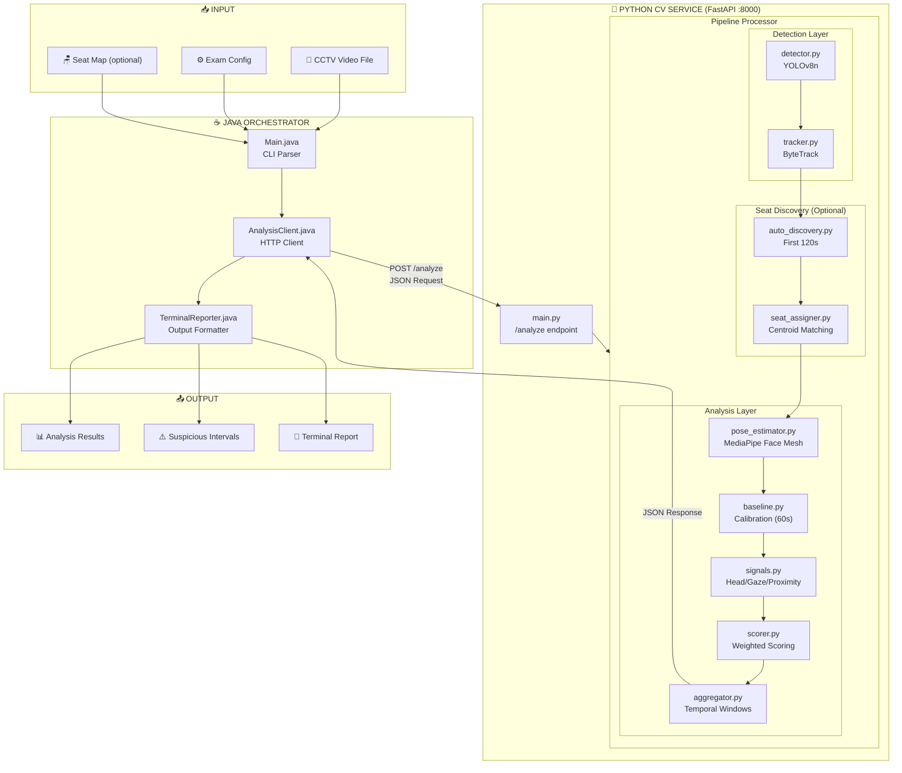
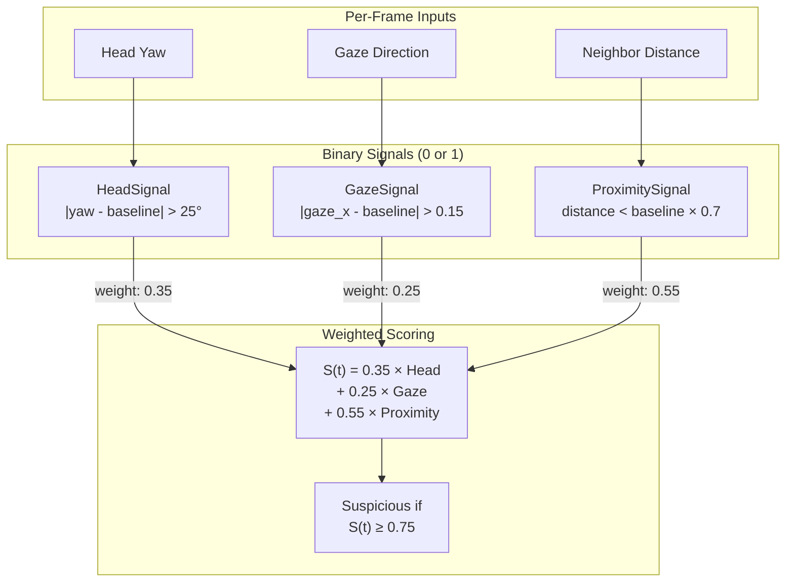
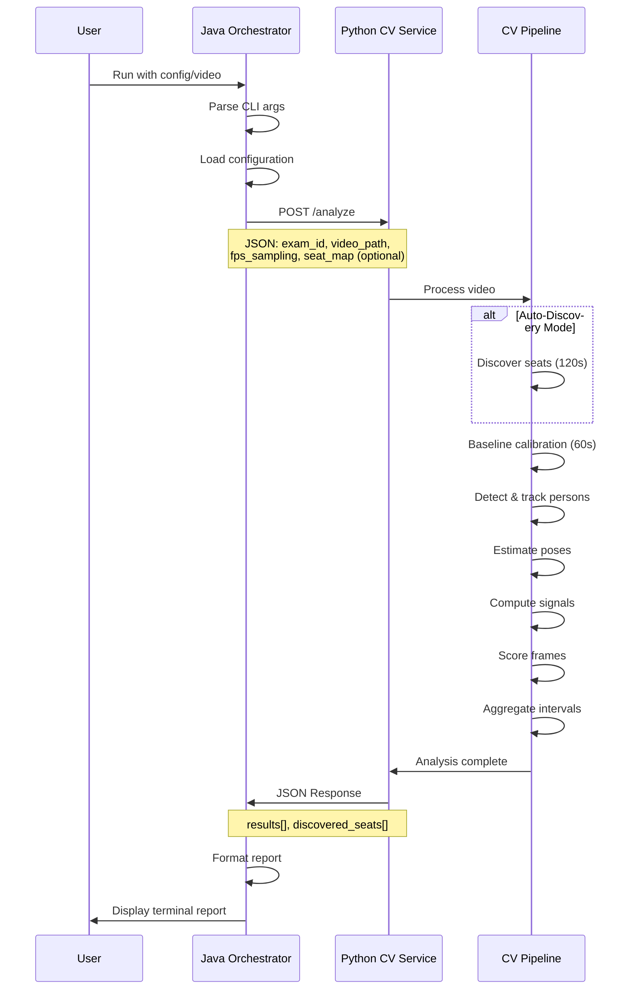
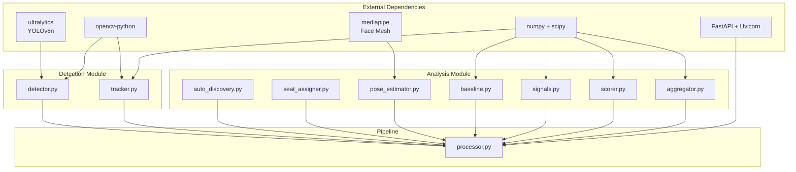
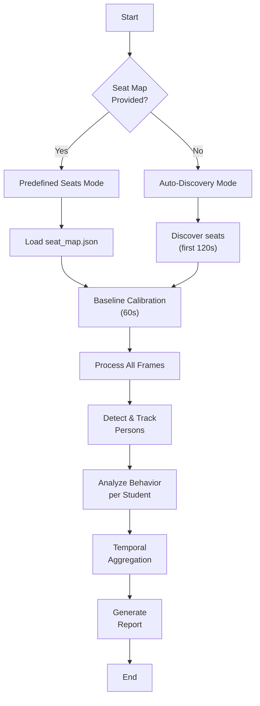

# Classroom Anti-Cheat System - Architecture Diagram

## System Overview

## Processing Pipeline Detail

```mermaid
flowchart LR
    subgraph Phase1["Phase 1: Ingestion"]
        V["Video"] -->|"5 FPS"| Frames["Frame<br/>Queue"]
    end
    
    subgraph Phase2["Phase 2: Detection"]
        Frames --> YOLO["YOLOv8n<br/>Person Detection"]
        YOLO --> BT["ByteTrack<br/>Multi-Object Tracking"]
        BT --> Seats["Seat<br/>Assignment"]
    end
    
    subgraph Phase3["Phase 3: Calibration"]
        Seats -->|"First 60s"| BL["Baseline<br/>Collection"]
        BL --> Metrics["Per-Student<br/>Baseline Metrics"]
    end
    
    subgraph Phase4["Phase 4: Analysis"]
        Metrics --> MP["MediaPipe<br/>Face Mesh"]
        MP --> Sig["Signal<br/>Computation"]
        Sig --> Score["Frame<br/>Scoring"]
    end
    
    subgraph Phase5["Phase 5: Aggregation"]
        Score --> Win["30s Sliding<br/>Window"]
        Win --> Merge["Interval<br/>Merging"]
        Merge --> Out["Suspicious<br/>Intervals"]
    end
```

## Signal Detection & Scoring

## API Communication Sequence

## Component Dependencies

## Execution Modes

